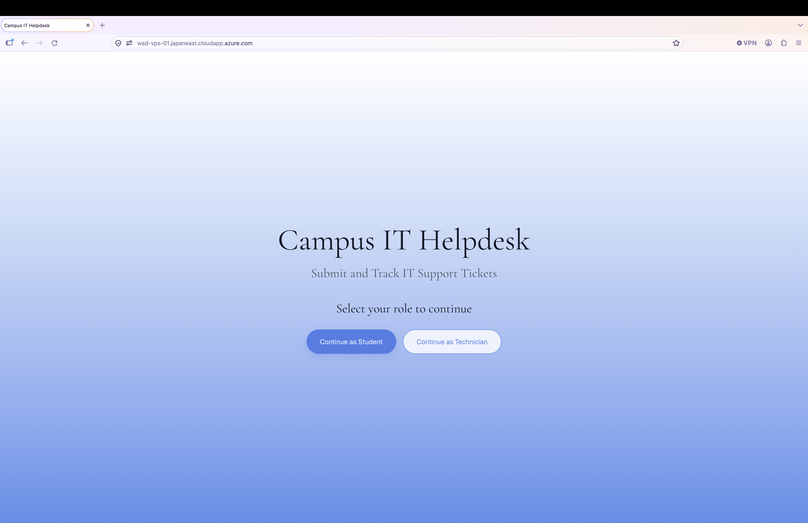
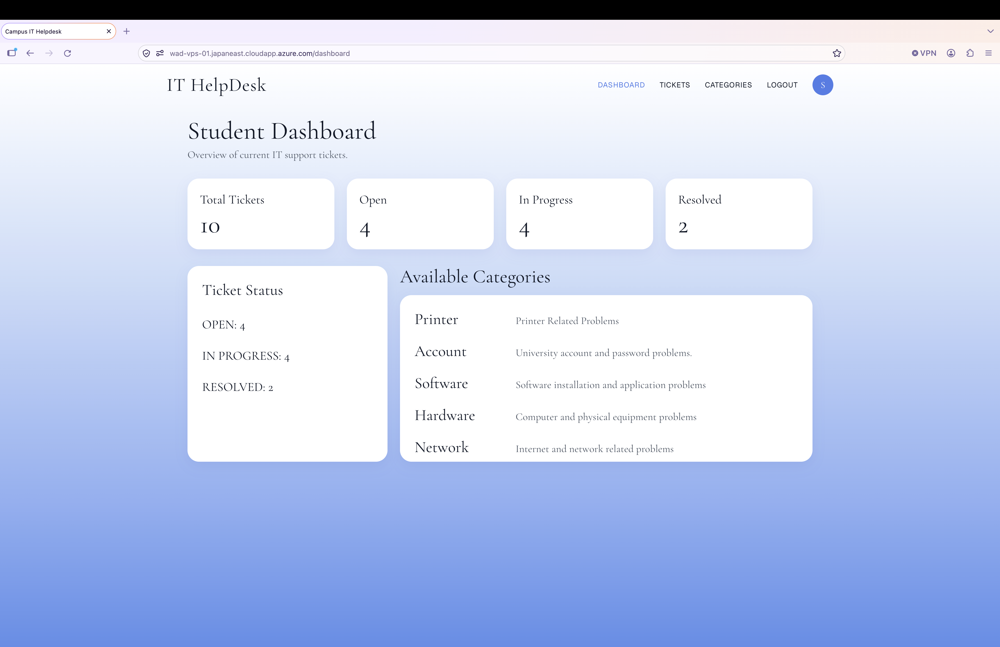
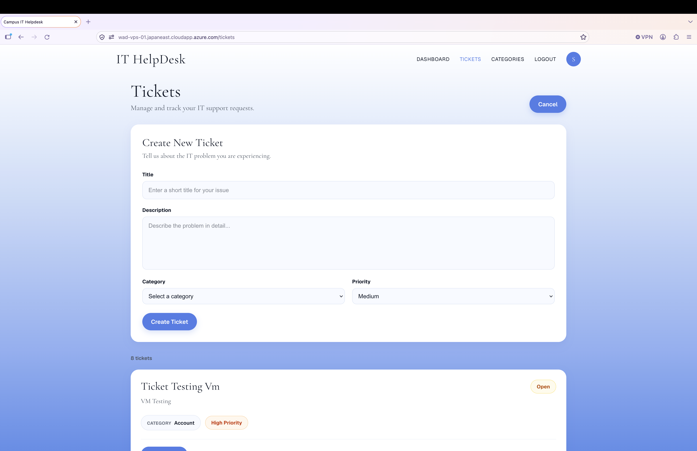
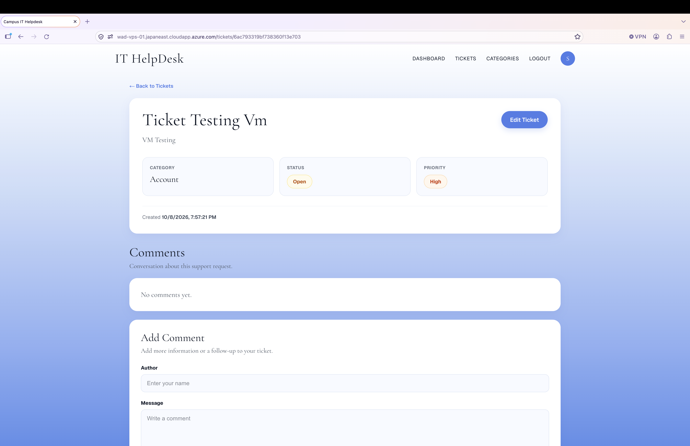
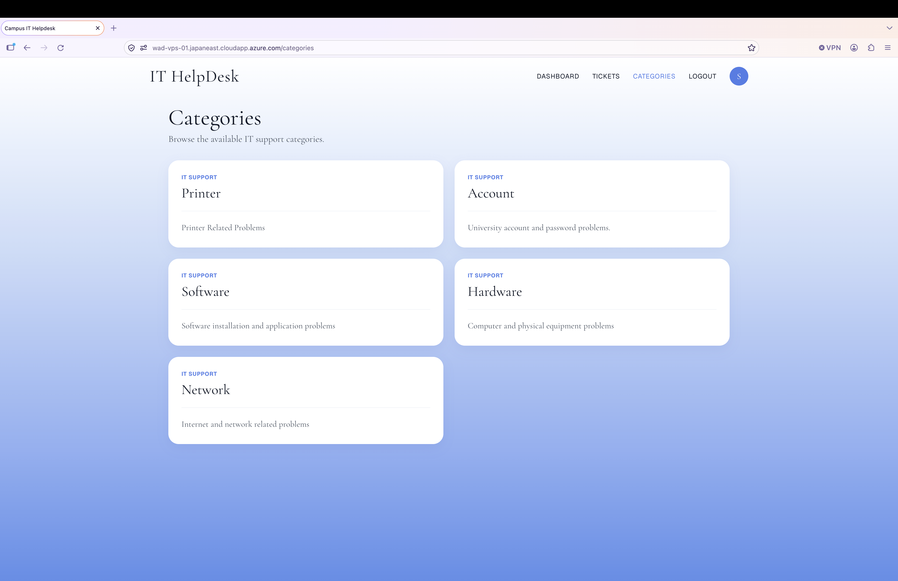
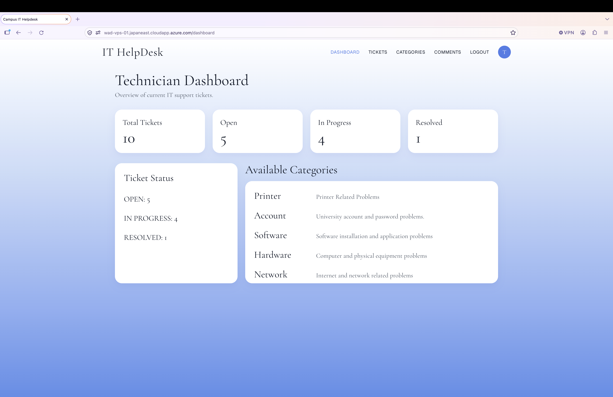
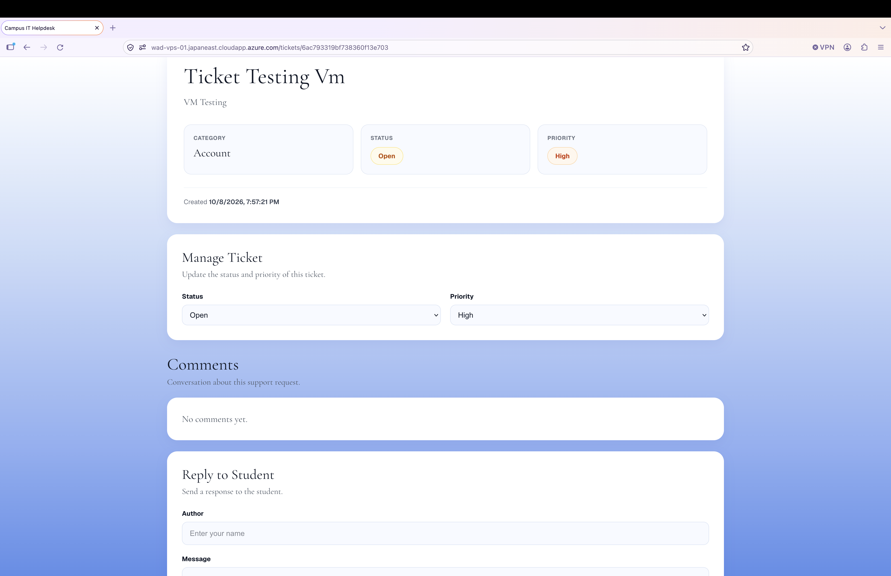
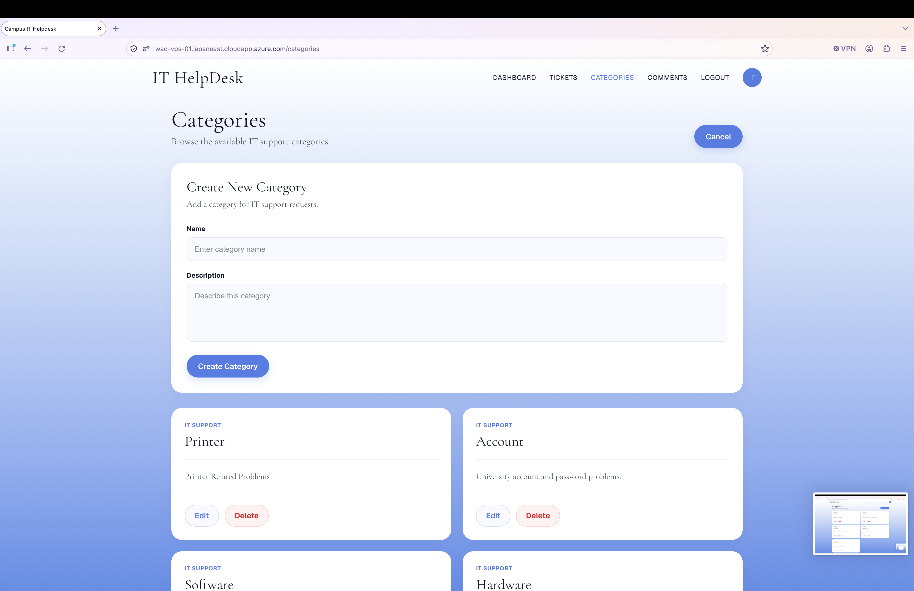
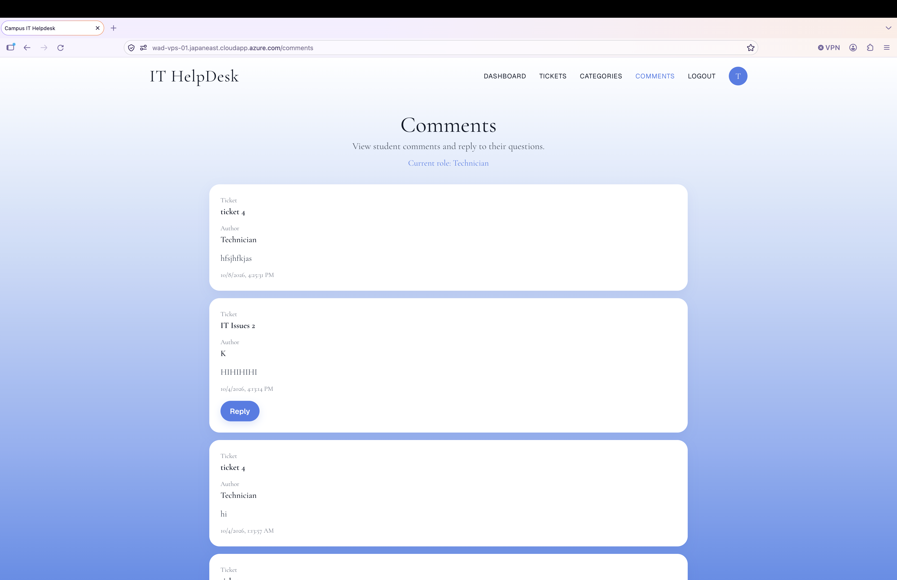

# Internal Campus IT HelpDesk System

## Team Member 
* Thaw Phone Thant 
* Wai Yan Thet Min 

## Github Repo
Link - https://github.com/kevindjr/HelpDesk_WAD.git

## Project Description

**Campus IT Helpdesk** is a web-based IT support ticket management system designed for use within a university campus.

The system allows students to submit IT support tickets when they experience technical problems. Users can provide information such as the problem title, description, category, and priority. Students can also view their tickets, track their status, and communicate with technicians through comments.

Technicians can view assigned support tickets, respond to student comments, update ticket information such as priority and status, and manage the progress of IT support requests.

The system provides a simple role-based interface with two main roles:

* **Student** – Create and manage support tickets, view ticket status, and communicate with technicians.
* **Technician** – View support tickets, respond to students, and update ticket status and priority.

### Main Features

* Create, view, update, and delete IT support tickets
* Organize tickets by categories
* Add and manage comments on tickets
* Set and update ticket priority
* Track ticket status
* Student and Technician role interfaces
* Dashboard for viewing ticket information
* REST API for system operations
* Persistent data storage using MongoDB

### Technologies

* **Next.js** – Frontend and backend/API
* **MongoDB** – Database
* **Mongoose** – MongoDB object modeling
* **JavaScript** – Application development
* **Docker** – Application containerization
* **Nginx** – Reverse proxy
* **Azure Virtual Machine** – Production deployment

## Data Models

The system uses three main data entities:

1. **Ticket**

   * Title
   * Description
   * Category
   * Priority
   * Status

2. **Category**

   * Category name

3. **Comment**

   * Comment content
   * Related ticket

These entities are managed through REST API endpoints implemented in the Next.js application.

## Application Preview

### HelpDesk Roles

### Student Dashboard

### Student Ticket Create

### Student Ticket View

### Student Category View

### Technician Dashboard

### Technician Ticket Manage

### Technician Category Create

### Technician Comments

